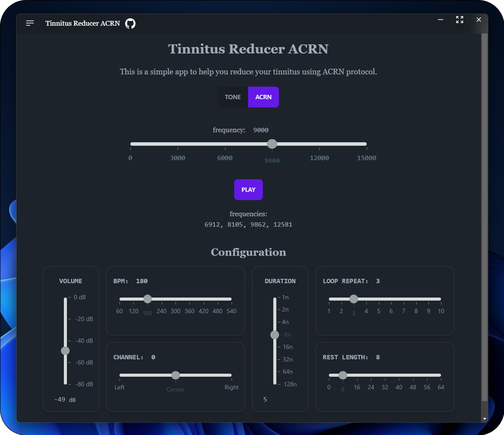

<h1 align="center">Tinnitus Reducer ACRN</h1>

This is a simple app to help you reduce your tinnitus using   ACRN (= Acoustic Coordinated Reset Neuromodulation) treatment.

  

## How to install

You can download the app installer from [Releases](https://github.com/r4ai/tinnitus-reducer-acrn/releases/latest) page. The app is available for Windows, macOS and Linux.  

For linux, because I don't have a linux machine, I can't test the app. If you have any problem, please let me know by opening an issue. Even for other OS, please let me know if you have any problem.

There are no mobile apps yet, but I am planning to make one.

## Caution

- I am not a doctor. I am not responsible for any worsening of symptoms by using this application.

## References

This app is heavily inspired by following softwares:

- [headphonejames/acrn](https://github.com/headphonejames/acrn)
- [headphonejames/acrn-react](https://github.com/headphonejames/acrn-react)

## About ACRN

### Paper

- [Impact of acoustic coordinated reset neuromodulation on effective connectivity in a neural network of phantom sound | ScienceDirect](https://www.sciencedirect.com/science/article/pii/S1053811913002553)

### Threads

- [Acoustic CR® Neuromodulation: a New Treatment for Tinnitus | TinnitusTalk](https://www.tinnitustalk.com/threads/acoustic-cr%C2%AE-neuromodulation-a-new-treatment-for-tinnitus.219/)
- [Success Using the Acoustic Coordinated Reset Neuromodulation (ACRN) Treatment | TinnitusTalk](https://www.tinnitustalk.com/threads/success-using-the-acoustic-coordinated-reset-neuromodulation-acrn-treatment.21747/)
- [Maybe old but this video is a great reminder of how ACRN works to reduce tinnitus. | Reddit](https://www.reddit.com/r/tinnitus/comments/8u52we/maybe_old_but_this_video_is_a_great_reminder_of)
